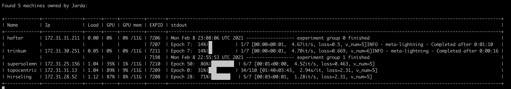

# The AWS management tool

A small set of scripts that allows user to deploy local (PyTorch) experiments to AWS and manage them easily.

Example of local experiment ran 3 times with different seeds:

```shell
python meta/run.py with lr=0.1
python meta/run.py with lr=0.1
python meta/run.py with lr=0.1
```
Example of remote version:

```shell
python -m aws launch 'python run.py with lr=0.1' --repeats=3
```
This launches an AWS instance, sets up requirements, runs script 3x and then the instance is auto-terminated.

By launching `monitor` user can get overview of currently running experiments, with realtime monitoring machine status and `stdout` of each experiment, launched by:

```
python -m aws monitor
```

This example output shows 5 machines running 7 experiments:




# Machine life-cycle

The tool provides a simple way to:

* Launch new machines with a command (experiment) to be executed
* Observe running machines
    
When launching the new instance, the following happens: 

   * Launches a new AWS instance from the prepared AMI image
   * Compresses the current project folder
   * Uploads to the instance
   * Runs the script on the instance
   * The script installs the dependencies and launches experiments
   * Then the machine shuts down itself (instance is configured to terminate on shutdown)

## Additional notes:

* The tool us meant to be used from the **root directory** of the repository for the experiment
* When the monitor is launched, logs from all experiments are downloaded to `remote/logs/[machine_name]` folder
* When a running monitor detects auto-shutdown of a machine (experiment finished or crashed), logs are downloaded as well
* The monitor might fail to detect the EXPID sometimes (asynchronous monitoring of `stdout`), just restart the monitor

# Requirements

The tool uses the `awscli` and `boto3` library for managing AWS instances and SSH for communication with running instances. The following is expected:
* User's PC has access to AWS, which includes:
  * `awscli` [installed](https://docs.aws.amazon.com/cli/latest/userguide/install-cliv2-linux.html)
  * aws access keys [obtained](https://docs.aws.amazon.com/powershell/latest/userguide/pstools-appendix-sign-up.html)
  * `awscli` [configured](https://docs.aws.amazon.com/cli/latest/userguide/cli-configure-quickstart.html#cli-configure-quickstart-config)
* User has a `*.pem` [key](https://docs.aws.amazon.com/AWSEC2/latest/UserGuide/ec2-key-pairs.html) to access the AWS
* Experiments handle their logging by themselves
  * In case a shared [Sacred](https://gitlab.goodai.com/shared-badger/badger-cloud#shared-omniboard-usage) storage is used, the tool detects and shows the experiment ID
* Machine AMI has conda environment called `pytorch_latest_p37` (e.g. derives from the [Deep Learning AMI](https://aws.amazon.com/machine-learning/amis/))
* The project has `requirements.txt` (installed in the `pytorch_latest_p37` environment after instance startup)

# Setup

* Install the aws tool from the source:
  ```bash
  cd aws
  pip install -r requirements.txt
  pip install -e .
  ```
  
* Run e.g. the monitor script:
  ```bash
  python -m aws monitor
  ```
  
* This should ask you for your (case-sensitive) name and generate the `~/.aws_config.yaml` file. 
  
* Fill in the full path to your `*.pem` file (and other fields tagged by `FILL_IN`) to the config:
  ```bash
  vim ~/.aws_config.yaml
  ```
* Run `python -m aws monitor` again to check the access (should show 0 instances running)
* You can test your access by launching a new machine, e.g. `python -m aws launch 'echo hello && sleep 10'`


# Available commands

Launch an instance that runs an experiment 3 times, machine able to run 2 experiments in parallel:


```bash
python -m aws launch 'python meta/run.py with max_batches=10' --repeats=3 --parallel=2
```


Monitor experiment progress (starts working after the instance finished setup) on running instances

```bash
python -m aws monitor
```


Observe progress of a machine experiment run in a more detailed way:

  
```bash
python aws tail [instance_name]
```

Observe progress of a machine setup:

```bash
python aws tail [instance_name] --setup
```

To show the script that will be executed on the remote machine:

```bash
python -m aws debugscript 'python meta/run.py with max_batches=10' --repeats=3 --parallel=2
```

For other commands, run: 
  
```bash
ptyhon -m aws --help
```

# Credits

AWS machine names are sampled from the text file which is originally obtained from [here](https://github.com/dwyl/english-words).

# Author

Jaroslav Vítků, GoodAI
